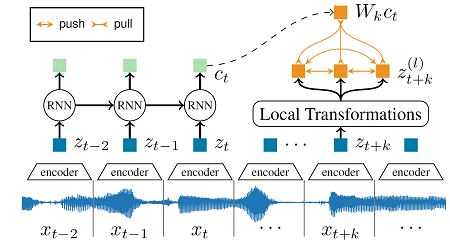
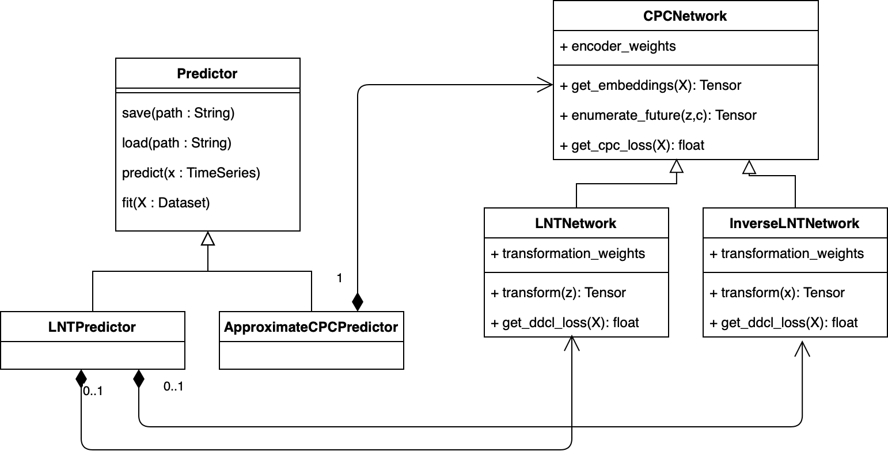

# Local Neural Transformations (LNT)

This is the companion code for the self-supervised anomaly detection algorithm proposed in the paper
Detecting Anomalies within Time Series using Local Neural Transformations by Tim Schneider et al. The paper can
be found here http://arxiv.org/abs/xxxx.xxxx. Please cite the
above paper when reporting, reproducing or extending the results.

We develop a new method to detect anomalies within time series, which is essential in many application domains, reaching from self-driving cars, finance, and marketing to medical diagnosis and epidemiology.
The method is based on self-supervised deep learning that has played a key role in facilitating deep anomaly detection on images, where powerful image transformations are available.
However, such transformations are widely unavailable for time series. Addressing this, we develop LNT, a method learning local transformations of time series from data.
The method produces an anomaly score for each time step and thus can be used to detect anomalies within time series. Our experiments demonstrate that LNT can find synthetic noise in speech segments from the LibriSpeech data set and better detect interruptions to cyber-physical systems than previous work.
Visualization of the learned transformations gives insight into the type of transformations that LNT learns.



### Purpose of the project

This software is a research prototype, solely developed for and published as part of the publication cited above. It will neither be maintained nor monitored in any way.

### Getting Started

To train your own local neural transformation network, simply run

```bash
python ord_main.py --config my_custom_lnt_config.yaml
```

Here, my_custom_lnt_config.yaml is a configuration file that contains all the hyperparameters.
Please find examples for such config files in the subfolder config/.

### Evaluation

After having trained your LNT anomaly detector, you can use it by calling its predict method on any time series.
In ord/evaluation.py we provide some handy helper functions that ease the evaluation of the trained models, like

```python
from utils import load_configuration
from ord.datasets import get_training_datasets_from_config
from ord import get_predictor_from_config
from ord.evaluation import compute_predictions, compute_roc_auc

config = load_configuration("./my_custom_lnt_config.yaml")
pred = get_predictor_from_config(config)
pred.load("./checkpoint.tar")

_,_, evaluation_data = get_training_datasets_from_config(config)
_, outlier_labels, outlier_scores = compute_predictions(pred, evaluation_data)
compute_roc_auc(outlier_labels, outlier_scores)
```

### Class Hierarchy



### Datasets

We provide dataloader classes that implement the pytorch Dataset protocol in the package ord.datasets.
The corresponding datasets can be found here:

- http://www.kaldi-asr.org/downloads/build/6/trunk/egs/librispeech/
- https://itrust.sutd.edu.sg/itrust-labs-home/itrust-labs_swat/
- https://itrust.sutd.edu.sg/itrust-labs-home/itrust-labs_wadi/

## License

Local Neural Transformations (LNT) is open-sourced under the AGPL-3.0 license. See the
[LICENSE](LICENSE) file for details.
